# Docker - Task-14

# Modernizacija aplikacija koristeci AWS i Docker


* * *
## Uvod

* * *

### Šta je kontejner

- Kontejner je standardna jedinica softvera koja pakira kod i sve njegove ovisnosti kako bi se aplikacije mogle brzo i pouzdano izvoditi iz jednog računalnog okruženja u drugo. 
- Slika kontejnera je lagani, samostalni, izvršni paket softvera koji uključuje sve što je potrebno za pokretanje aplikacije: kod, vrijeme izvođenja, sistemske alate, sistemske biblioteke i postavke.
- To omogućuje razvojnim programerima da budu produktivniji jer umjesto da se moraju brinuti o raznim ovisnostima koje vaši kolege možda koriste za pokretanje svog koda, oni mogu jednostavno spakirati sav svoj kod i njegove ovisnosti u kontejner, tako da imate sve što vam je potrebno da ostanete produktivni.

### Koja je razlika između virtualne mašine (VM) i Dockera

- **Kontejneri virtaliziraju Operativni sustav (OS) umjesto hardware-a.**
- Kontejneri su mnogo više portabilni i efikasni.

### Virtualne mašine


- Virtualni strojevi (VM) su apstrakcija fizičkog hardvera koji pretvara jedan poslužitelj u više poslužitelja. Hipervizor omogućuje rad više VM-ova na jednom stroju. Svaki VM uključuje punu kopiju operativnog sustava, aplikacije, potrebne binarne datoteke i biblioteke - koje zauzimaju desetke GB. VM također mogu biti spori za pokretanje. Donji dijagram daje vizualni prikaz kako bi izgledalo pokretanje virtualnog stroja.


### Kontejneri

- Kontejneri su apstrakcija na sloju aplikacije koja zajedno pakira kod i zavisnosti. Više kontejnera može raditi na istom stroju i dijeliti jezgro OS-a s drugim kontejnerima, od kojih svaki radi kao izolirani procesi u korisničkom prostoru. Kontejneri zauzimaju manje prostora od VM-a (slike kontejnera su obično veličine desetine MB), mogu da obrađuju više aplikacija i zahtjevaju manje VM-ova i operativnih sistema.


* * *
# Docker Engine

* * *

- Docker Engine omogućava kontejnerskim aplikacijama da dosljedno rade bilo gdje na bilo kojoj infrastrukturi, rješavajući probleme ovisnosti za programere i operativne timove i eliminirajući "radi na mom laptopu!" problem. 
- Docker Engine obuhvata kompletan skup funkcija i alata koji pomažu korisnicima da budu što efikasniji kada rade sa kontejnerima. 
- Tri ključne karakteristike i mogućnosti koje pokreće Docker Engine mogu se sažeti na sljedeći način:

1. Pokreće ga containerd koji je standardno radno vrijeme kontejnera s naglaskom na jednostavnosti, robusnosti i prenosivosti.

2. Integracija sa Buildkit-om koji je Dockers najčešće korištena karakteristika Docker Engine-a. Docker Buildkit se prvenstveno koristi za pravljenje slika iz Dockerfile-a .

3. Jednostavnost i pristupačnost Docker CLI-a .


- Ispod haube, Docker Engine je klijent-server aplikacija sa sljedećim glavnim komponentama:

1. Server koji je tip dugotrajnog programa koji se naziva deamon proces (dockerd komanda).

2. REST API koji specificira interfejse koje programi mogu koristiti da razgovaraju sa deamonom i daju mu uputstva šta da radi.

3. Klijent interfejsa komandne linije (CLI) (docker komanda).

- CLI koristi Docker REST API za kontrolu ili interakciju s Docker demonom putem skriptiranja ili direktnih CLI komandi. Mnoge druge Docker aplikacije koriste osnovni API i CLI.

- Deamon kreira i upravlja Docker objektima, kao što su slike, kontejneri, mreže i volumeni.

* * *

# DOCKER SLIKE

* * *
- Kontejner slika je predložak je samo za čitanje s uputama za izradu spremnika. 
- Slika sadrži kôd koji će se izvoditi, uključujući sve definicije za sve biblioteke i ovisnosti koje vaš kôd treba izvoditi. 
- Često se slika temelji na drugoj slici uz neke dodatne prilagodbe. 
- Važno je napomenuti da ove slike nisu samo jedan monolitni blok, već se sastoje od mnogo slojeva. 


## Dockerfile i docker slika

- Sada kada razumijemo opće koncepte o tome što je slika spremnika, zaronimo u to kako se to odnosi na Docker slike koje se također mogu nazivati Dockerfile.
- Baš kao i slika kontejnera koju smo spomenuli gore, Dockerfiles i Docker slike također pružaju prijenosno okruženje za izvršavanje aplikacija, pakiraju aplikacije i ovisnosti u jedan, nepromjenjivi artefakt, daju korisnicima mogućnost pokretanja različitih verzija aplikacija istovremeno i daju brže cikluse razvoja i implementacije.

```
FROM ubuntu:15.04
COPY . /app
RUN make /app
CMD python /app/app.py
```

Ova Docker datoteka sadrži četiri naredbe, od kojih svaka stvara sloj. Izjava FROM počinje stvaranjem sloja iz ubuntu:15.04 slike. Naredba COPY dodaje neke datoteke iz trenutnog direktorija vašeg Docker klijenta. Naredba RUN gradi vašu aplikaciju pomoću naredbe make. Konačno, posljednji sloj određuje koju naredbu treba pokrenuti unutar spremnika.

Svaki sloj samo je skup razlika u odnosu na sloj prije njega. Slojevi se slažu jedan na drugi. Kada stvorite novi kontejner, dodajete novi sloj za pisanje na vrh donjih slojeva. Ovaj sloj se često naziva "sloj kontejnera". Sve promjene napravljene na kontejneru koji radi, kao što je pisanje novih datoteka, modificiranje postojećih datoteka i brisanje datoteka, zapisuju se u ovaj tanki sloj kontejnera za pisanje. Donji dijagram prikazuje spremnik temeljen na Ubuntu 15.04 slici.

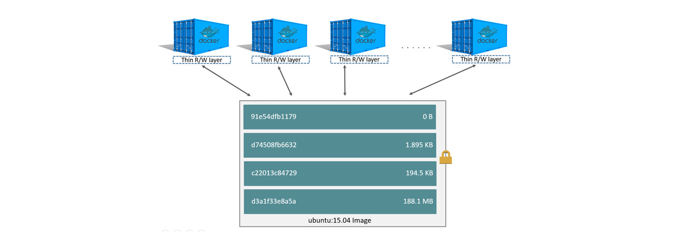


## Sažetak

Docker datoteke su izvor istine kada se radi o izgradnji i pokretanju Docker slika. Dockerfile je artefakt koji vi stvorite, a koji zauzvrat proizvodi Docker sliku kada je izgradite. Dockerfile uključuje upute o tome kako točno izraditi tu sliku i što ta slika treba sadržavati. Docker datoteke uključuju korak po korak upute o tome kako treba izgraditi sliku vašeg spremnika. Primjeri mogu biti izvlačenje određene verzije Node.js ili mogu uključivati upute za instaliranje programa kao što je jq tako da kada pokrenete kontejner imate sve što vam je potrebno i uklanja potrebu za ručnim instaliranjem svih alata ili ovisnosti koje biste trebali pokrenuti spremnik ispravno.

Nakon što izgradite svoju Docker sliku prema uputama navedenim u Docker datoteci, sljedeći korak je gurnuti tu sliku u spremište slika kao što je Docker Hub  i tada imate izbor pokretanja tog kontejnera lokalno da se vidi da radi ili implementacije te slike na Amazon ECS. 


* * *
# DOCKER HUB
* * *

## Kontejner Registriji

### Šta je Docker Hub?

- Docker Hub najveće je svjetsko spremište slika kontejnera s nizom izvora sadržaja uključujući programere zajednice kontejnera, projekte otvorenog koda i neovisne dobavljače softvera (ISV) koji izgrađuju i distribuiraju svoj kod u kontejnerima.               
- Korisnici dobivaju pristup besplatnim javnim spremištima za pohranjivanje i dijeljenje slika ili mogu odabrati plan pretplate za privatne repozitorije.

### Zašto biste trebali koristiti Docker Hub za svoje organizacijske potrebe?

- Docker Hub izvrstan je izbor za dijeljenje slika kontejnera u vašoj organizaciji. 
- Docker Hub pruža jedinstveno iskustvo za pronalaženje, pohranjivanje i dijeljenje slika kontejnera.                                                 
- Milijuni pojedinačnih korisnika i više od sto tisuća organizacija koriste Docker Hub za svoje potrebe sadržaja spremnika.  
- Docker Hub osmišljen je kako bi pomogao spojiti sve značajke koje su se pokazale uspješnima u organizacijama svih veličina i razlog je zašto koristimo Docker Hub za ovu radionicu. Evo nekih od prednosti koje korisnici imaju korištenjem Docker Huba:

1. Kada koristite repozitorije unutar Docker Hub-a, možete pogledati nedavno dodane oznake i automatizirane nadogradnje na svojoj stranici repozitorija i jednostavno filtrirati slike kao što je prikazano u nastavku:


* * *
# AMAZON ECS
* * *

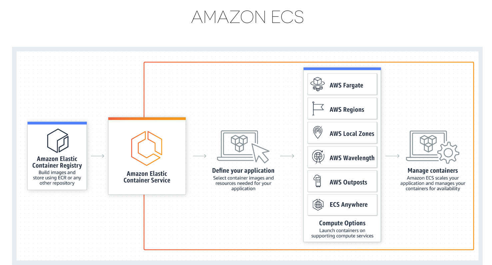

### Što je Amazon ECS?

Amazon Elastic Container Service (Amazon ECS) je visoko skalabilna, brza usluga upravljanja kontejnerima koja olakšava pokretanje, zaustavljanje i upravljanje tim kontejnerima na klasteru. U ovom kontekstu, usluga je konfiguracija koja nam omogućuje pokretanje i održavanje određenog broja zadataka istovremeno u klasteru. Možete pokrenuti svoje zadatke i usluge na infrastrukturi bez poslužitelja kojom upravlja AWS Fargate. Alternativno, za veću kontrolu nad svojom infrastrukturom, možemo pokretati svoje zadatke i usluge na klasteru instanci Amazon EC2 kojom upravljamo.

### Zašto Amazon ECS?

Amazon ECS ima niz različitih slučajeva upotrebe i dobro se integrira s ostatkom AWS ekosustava. Osim toga, budući da je ECS bio temeljni stup za ključne Amazonove usluge, može se izvorno integrirati s drugim uslugama kao što su Amazon Route 53, Secrets Manager, AWS IAM i Amazon CloudWatch, pružajući nam poznato iskustvo za implementaciju i mjerenje svojih kontejnera. Slučajevi upotrebe korisnika Amazon ECS-a kreću se od postavljanja web aplikacija pa sve do slučajeva upotrebe strojnog učenja, tako da ako se vaša aplikacija može pokrenuti unutar kontejnera, vrlo je velika vjerojatnost da ćete moći koristiti Amazon ECS kao svoje najčešće rješenje za orkestraciju kontejnera .


### Zašto korisnici vole koristiti Amazon ECS

Amazon ECS omogućuje korisnicima da se usredotoče na izgradnju aplikacija, a ne na infrastrukturu. 
Amazon ECS pruža okruženja svim korisnicima kako bi se poboljšala brzina razvojnih programera, tako da ne morate brinuti o različitim alatima za pokretanje vaših kontejnera.
Amazon ECS će brzo i neprimjetno skalirati umjesto vas, tako da to ne morate raditi ručno. 
Na vama kao korisniku je smanjeno operativno opterećenje jer je AWS uklonio težak posao upravljanja infrastrukturom kako se zahtjevi mijenjaju na vašoj aplikaciji.
Amazon ECS je dizajniran tako da je sigurnost na prvom mjestu i izoliran je po dizajnu. 
Korisnici koji koriste Amazon ECS mogu s lakoćom implementirati svoje aplikacije i upravljati njima, jer je Amazon ECS izgrađen s jedinstvenom sigurnošću u svim okruženjima i održava se automatizacijom.

* * *
# Preduvjeti za zadatak
* * *

##  1. Kreirati vlastiti AWS racun

## 2. Kreirati radno okruzenje

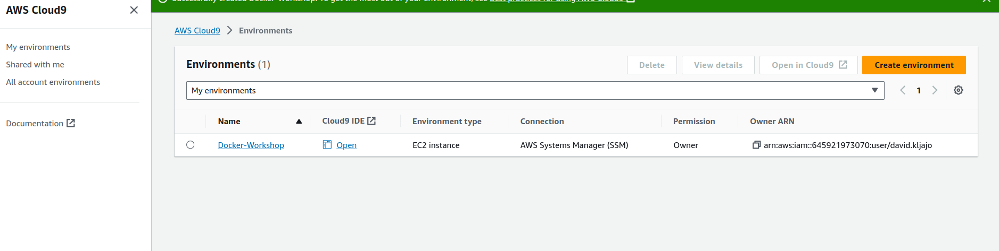

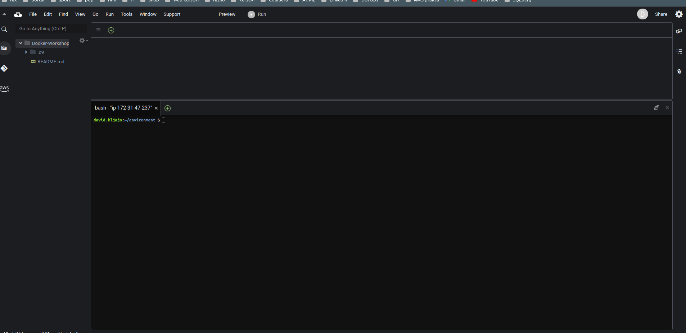


## 3. Kreirati IAM rolu za nase radno okruzenje

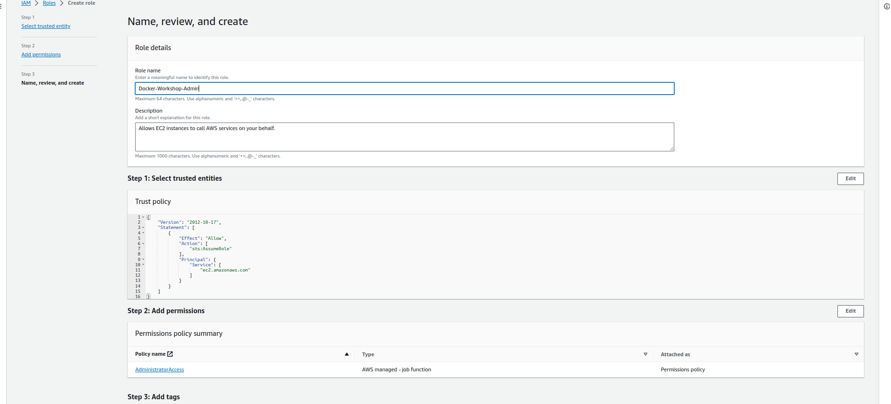

## 4.Zakaciti IAM rolu za nase radno okruzenje

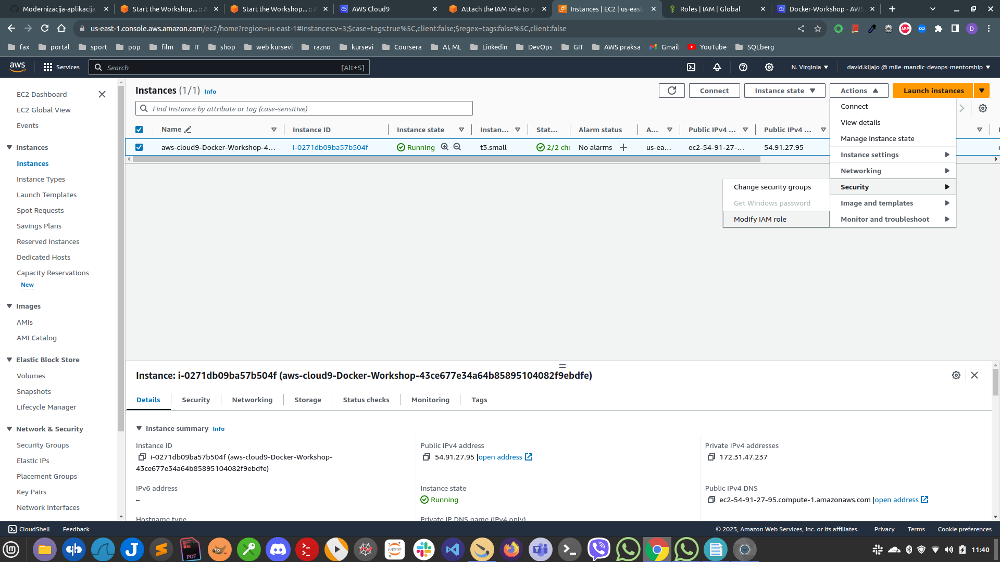


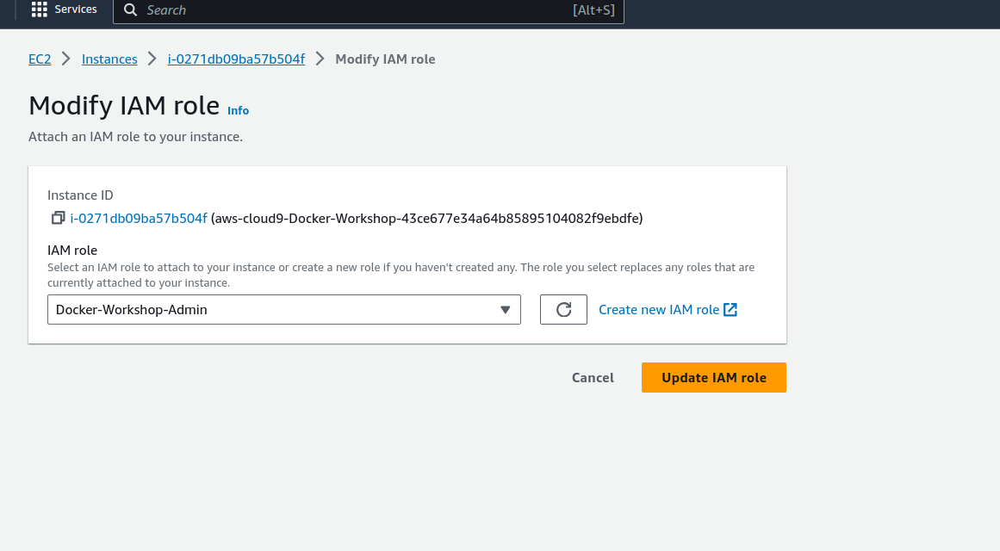

## 5. Promijenuti IAM postavke za nase radno okruzenje

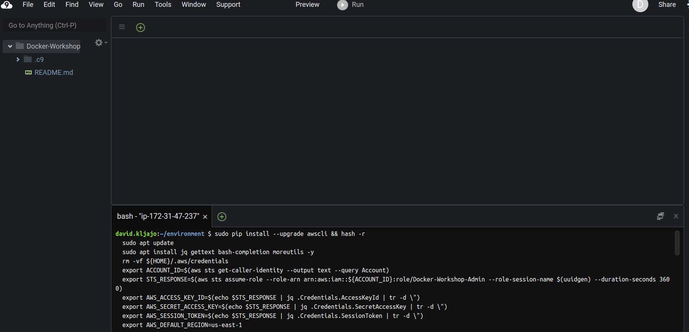

## 6. Konfigurirati Docker na Cloud9


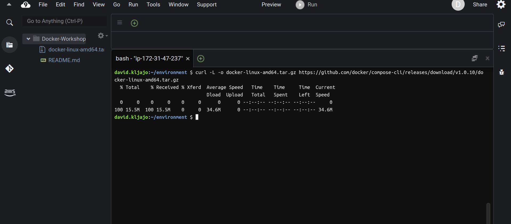

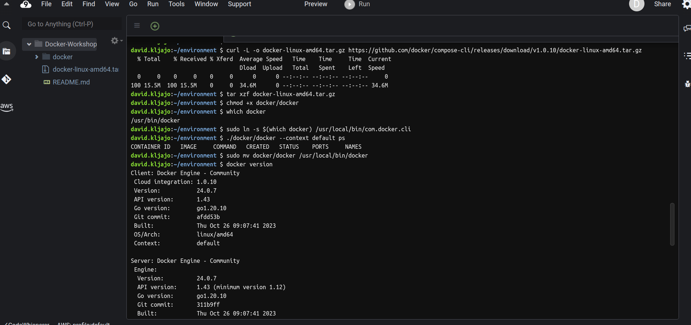

* * *
# Docker Buildkit i Docker Compose
* * *

- Docker Compose je alat za definiranje i pokretanje Docker aplikacija s više kontejnera.
- Uz Docker Compose, koristite YAML datoteku za konfiguraciju usluga svoje aplikacije.
- Zatim, jednom naredbom, kreirate i pokrećete sve usluge iz svoje konfiguracijske datoteke.
- Primjeri bi bili dodavanje baze podataka ili mehanizma za predmemoriju za vašu aplikaciju.

## Kako se Docker Compose razlikuje od Dockerfiles

- Korisnici koji se tek upoznaju s kontejnerima i Dockerom mogu biti stvarno zbunjeni kada i gdje koristiti Dockerfiles i Docker Compose datoteke.
- Iako postoje situacije u kojima možete koristiti jedno ili drugo, zapravo se svodi na složenost vaše aplikacije koju planirate implementirati.
- U modernim aplikacijama vrlo je uobičajeno vidjeti da aplikacije koriste oboje. To znači da možete imati Docker Compose datoteku koja će se oslanjati na Dockerfile kako bi izgradila vašu aplikaciju. U ovom odjeljku naučit ćemo kako upotrijebiti oboje u izradi naše aplikacije pa ako to nema smisla u ovom trenutku.

## Docker Compose integracija sa Amazon ECS

The Docker Compose CLI omogucuje programerima da koriste nativne Docker komande da pokrenu aplikacije u  Amazon Elastic Container Service (Amazon ECS) kada prave cluod-bazirane aplikacije.

## Primjer prikaza arhitekture aplikacije

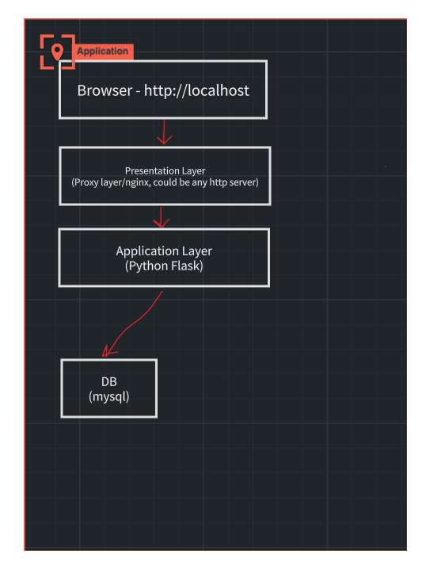

`git clone https://github.com/"your github username"/docker-compose-ecs-sample`

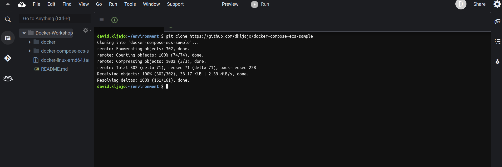

# Bildamo sliku lokalno

`docker-copmose.yml`


`docker compose build`

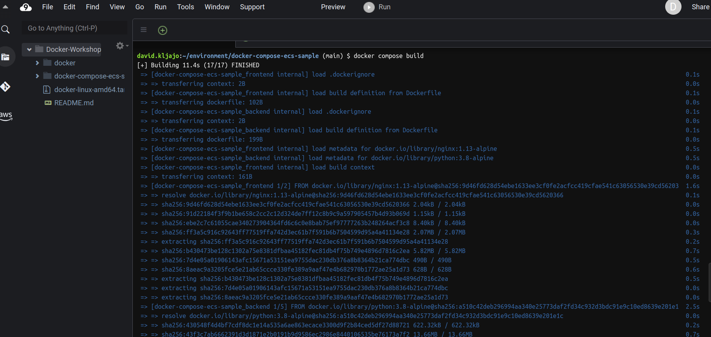

`docker images`

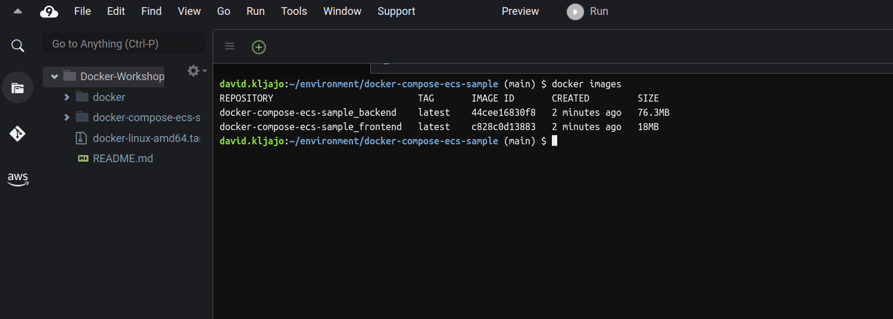

## Gurnuti (pushati) slike na Docker Hub

`DOCKER_HUB_ID=FILL_ME_WITH_YOUR_DOCKER_HUB_ID`

`$ docker login -u ${DOCKER_HUB_ID}`
`Password: `
`Login Succeeded`

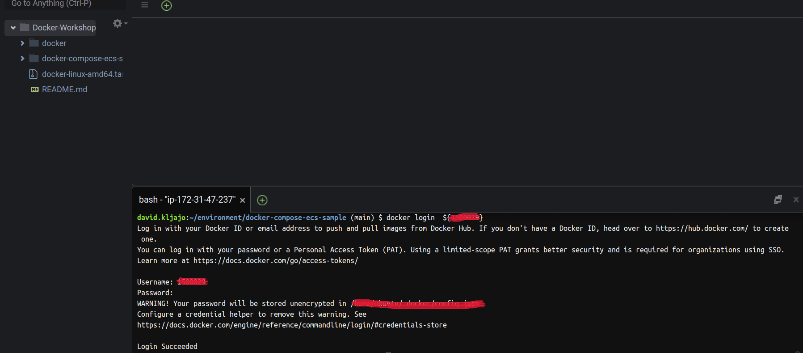

`docker push ${DOCKER_HUB_ID}/docker-compose-ecs-sample_backend:latest`

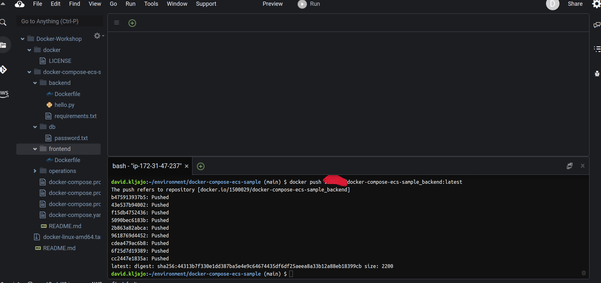


`docker push ${DOCKER_HUB_ID}/docker-compose-ecs-sample_frontend:latest`

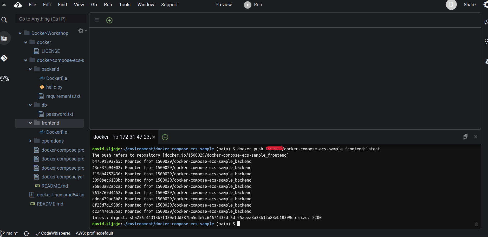

## Pokretanje aplikacije lokalno

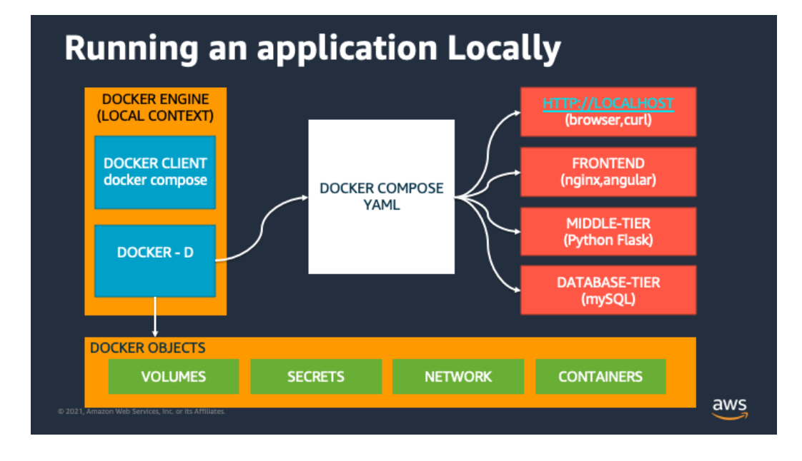

`docker compose up -d`

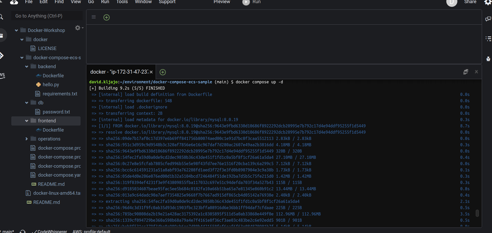

`docker compose logs`

`

## Pokrenuti aplikaciju

`curl http://localhost:3000`


